# Gradius

## ER Diagram

Phase 1 - Demo

```mermaid
erDiagram
    Game {
        string id PK
        string status "WAITING | PLAYING | END"
        datetime createdAt
    }
    Player {
        string userId PK
        float x
        float y
        int life
        int score
        float speed
        int gameId FK
    }
    Bullet {
        int id PK
        int damage
        string type "BULLET | MISSILE | LASER"
        boolean isPlayerBullet
        string gameId FK
    }
    Enemy {
        int id PK
        int health
        int score
        int gameId FK
    }

    Game ||--|{ Player : "contains"
    Game ||--o{ Enemy: "contains"
    Game ||--o{ Bullet: "has"
```



# Next frourio starter

フロントエンドは src ディレクトリの [Next.js](https://nextjs.org/) 、バックエンドは server ディレクトリの [frourio](https://frourio.com/) で構築された TypeScript で一気通貫開発が可能なモノレポサービス

## 開発手順

### Node.js のインストール

ローカルマシンに直接インストールする

https://nodejs.org/ja/ の左ボタン、LTS をダウンロードしてインストール

### リポジトリのクローンと npm モジュールのインストール

フロントとバックエンドそれぞれに package.json があるので 2 回インストールが必要

```sh
$ npm i
$ npm i --prefix server
```

### 環境変数ファイルの作成

```sh
$ cp .env.example .env
$ cp server/.env.example server/.env
$ cp docker/dev/.env.example docker/dev/.env
$ cp server/prisma/.env.example server/prisma/.env
```

### ミドルウェアのセットアップ

```sh
$ docker-compose up -d
```

### 開発サーバー起動

次回以降は以下のコマンドだけで開発できる

```sh
$ npm run notios
```

Web ブラウザで http://localhost:3000 を開く

開発時のターミナル表示は [notios](https://github.com/frouriojs/notios) で制御している

[Node.js モノレポ開発のターミナルログ混雑解消のための新作 CLI ツール notios](https://zenn.dev/luma/articles/nodejs-new-cli-tool-notios)

閉じるときは `Ctrl + C` を 2 回連続で入力

#### Firebase Emulator

http://localhost:4000/auth

#### MinIO Console

http://localhost:9001/

#### PostgreSQL UI

```sh
$ cd server
$ npx prisma studio
```
